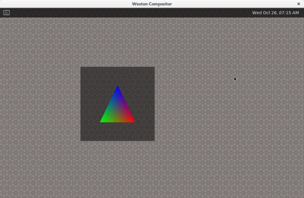
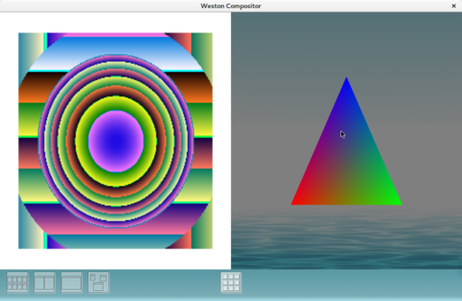

## Table of Contents
  * [Demo](#demo)
  * [Usage](#usage)

## Demo
### launch desktop-shell


### launch ivi-shell(hmi-controller)


## Usage

### 1. ContainerからX serverへの接続を許可
起動するコンテナのhostnameを追加します。
(hostnameコマンドで確認できます)

ホスト側で実行:
```
xhost +local:ubuntu
```

### 2. コンテナを起動
ホスト側で実行:
```
docker run -ti --rm -e DISPLAY=$DISPLAY -v /tmp/.X11-unix --device /dev/dri/card0 --net=host yuu3/docker-build-env:weston_latest
```

ホストのDISPLAYが設定されていない場合:  
以下のコマンドで起動中のアプリケーションから確認できます($pidを任意に変更してください)
```
strings /proc/$pid/environ| grep '^DISPLAY='
```

### 3. westonを起動
コンテナ側で実行:
```bash
source scripts/weston_env
sudo -E ./usrfs/bin/weston &
sudo -E ./work/weston/weston/weston-simple-egl
```

### ivi-shellを起動する場合
westonを起動する前にweston.iniをコピーしてください
```
mkdir ~/.config
cp ~/work/weston/weston/ivi-shell/weston.ini ~/.config
```
